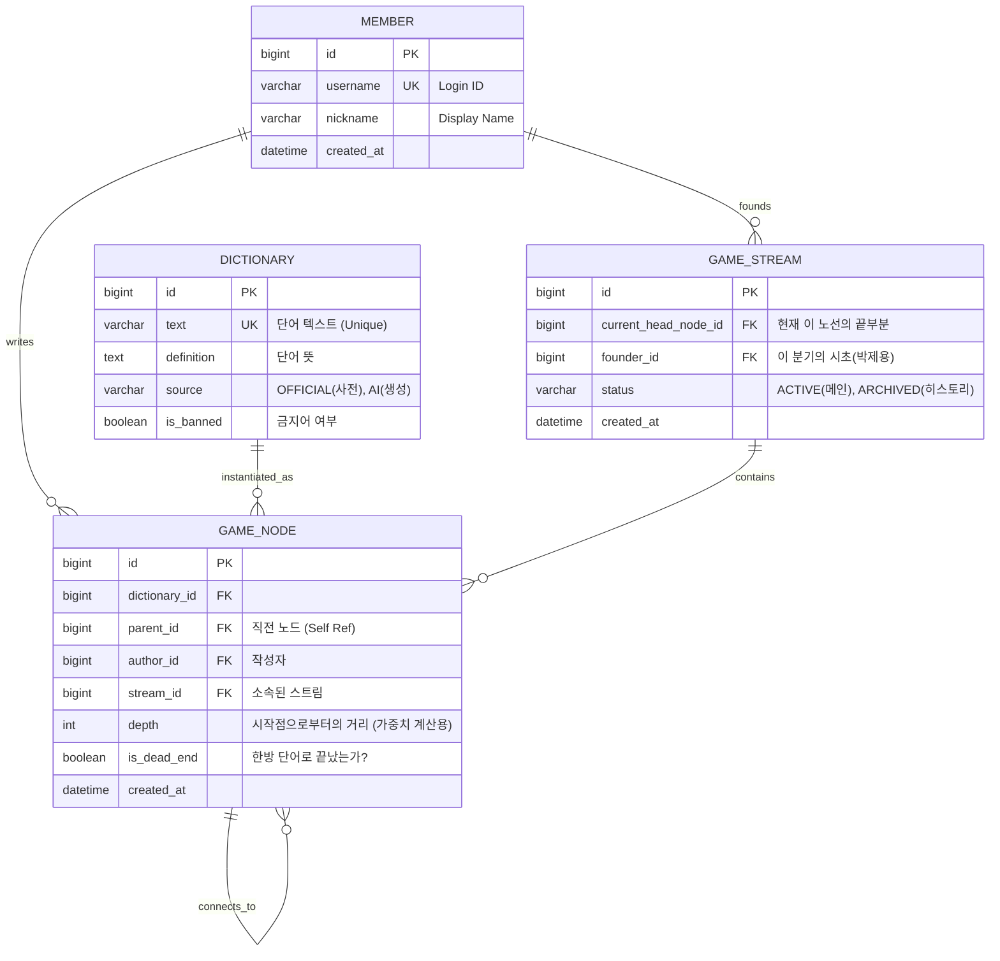

### 1. 설계 개요 (Design Overview)

본 프로젝트의 핵심인 **'Git 브랜치 스타일의 무한 확장 데이터'**와 **'실시간 스트림 탈취(Hijacking)'** 기능을 지원하기 위해, **정규화(Normalization)**와 **조회 성능(Read Performance)**의 균형을 맞춘 설계를 지향한다.

- **설계 목표**:
    1. **트리 구조 최적화**: 수만 개의 노드가 얽힌 관계를 효율적으로 저장 및 조회 (Adjacency List Pattern 적용).
    2. **데이터 재사용성**: '사전(Dictionary)'과 '게임 배치(Node)'를 분리하여 단어 데이터의 중복을 제거.
    3. **상태 관리의 명확성**: 현재의 '메인스트림'과 과거의 '히스토리'를 명확히 구분.

---

### 2. ERD (Entity Relationship Diagram)

아래 다이어그램은 핵심 도메인 간의 관계를 나타낸다.



---

### 3. 테이블 상세 명세 (Table Specifications)

### 3.1 `member` (사용자)

가장 기본적인 사용자 정보를 저장한다.

- **특이사항**: 추후 OAuth2 도입을 고려하여 확장이 용이한 구조 유지.

### 3.2 `dictionary` (단어 사전)

게임 판(Node)과 독립적으로 존재하는 **'순수 단어 데이터'** 저장소.

- **Design Decision**:
    - 왜 `GameNode`와 분리했는가? -> '사과'라는 단어가 게임 내 수백 번 등장하더라도, 뜻과 출처 정보는 한 번만 저장하여 데이터 정합성을 유지하고 용량을 절약하기 위함.

### 3.3 `game_stream` (스트림 상태)

현재 활성화된 '메인스트림'과 과거로 밀려난 '아카이브 스트림'을 관리하는 상태 테이블.

- **핵심 컬럼**:
    - `status`: **'ACTIVE'** (현재 메인), **'ARCHIVED'** (탈취당해 역사로 남음).
    - `current_head_node_id`: 해당 스트림의 가장 최신 노드를 가리킴. 유저 접속 시 이곳으로 포커싱.

### 3.4 `game_node` (게임 노드) - 🔥 핵심

실질적인 트리 구조를 형성하는 테이블.

- **Design Decision (Tree Pattern)**:
    - **Adjacency List (인접 리스트) 방식 채택**: `parent_id` 컬럼을 사용하여 자기 자신을 참조.
    - **이유**: 무한히 뻗어 나가는 구조에서 '쓰기(INSERT)' 성능이 가장 빠르며, `WITH RECURSIVE` 쿼리를 통해 조회 성능도 커버 가능함.
- **Indexing Strategy (성능 최적화)**:
    - `idx_parent_id`: 특정 노드의 자식들을 빠르게 조회(Lazy Loading)하기 위해 필수.
    - `idx_stream_id`: 특정 스트림에 속한 모든 노드를 한 번에 가져오기 위해 필수.

---

### 4. DDL Script (MySQL 8.0+)

프로젝트 초기 세팅 시 실행할 SQL 스크립트.

```sql
-- 1. 사용자 테이블
CREATE TABLE member (
    id BIGINT AUTO_INCREMENT PRIMARY KEY,
    username VARCHAR(50) NOT NULL UNIQUE,
    password VARCHAR(255) NOT NULL,
    nickname VARCHAR(50) NOT NULL,
    role VARCHAR(20) DEFAULT 'ROLE_USER',
    created_at DATETIME DEFAULT CURRENT_TIMESTAMP
);

-- 2. 단어 사전 테이블
CREATE TABLE dictionary (
    id BIGINT AUTO_INCREMENT PRIMARY KEY,
    text VARCHAR(100) NOT NULL UNIQUE, -- 검색 성능을 위해 길이 제한 및 인덱싱
    definition TEXT,
    source VARCHAR(20) NOT NULL COMMENT 'OFFICIAL, AI_GENERATED',
    is_verified BOOLEAN DEFAULT FALSE,
    created_at DATETIME DEFAULT CURRENT_TIMESTAMP,
    INDEX idx_text (text) -- 단어 검색용 인덱스
);

-- 3. 게임 스트림 테이블
CREATE TABLE game_stream (
    id BIGINT AUTO_INCREMENT PRIMARY KEY,
    founder_id BIGINT COMMENT '분기 개설자',
    status VARCHAR(20) DEFAULT 'ACTIVE' COMMENT 'ACTIVE, ARCHIVED',
    created_at DATETIME DEFAULT CURRENT_TIMESTAMP,
    updated_at DATETIME DEFAULT CURRENT_TIMESTAMP ON UPDATE CURRENT_TIMESTAMP,
    FOREIGN KEY (founder_id) REFERENCES member(id)
);

-- 4. 게임 노드 테이블
CREATE TABLE game_node (
    id BIGINT AUTO_INCREMENT PRIMARY KEY,
    dictionary_id BIGINT NOT NULL,
    parent_id BIGINT COMMENT 'Root 노드일 경우 NULL',
    author_id BIGINT NOT NULL,
    stream_id BIGINT NOT NULL,
    depth INT DEFAULT 0 COMMENT '루트로부터의 깊이',
    is_dead_end BOOLEAN DEFAULT FALSE COMMENT '한방 단어 여부',
    created_at DATETIME DEFAULT CURRENT_TIMESTAMP,

    FOREIGN KEY (dictionary_id) REFERENCES dictionary(id),
    FOREIGN KEY (parent_id) REFERENCES game_node(id),
    FOREIGN KEY (author_id) REFERENCES member(id),
    FOREIGN KEY (stream_id) REFERENCES game_stream(id),

    -- [성능 최적화 인덱스]
    INDEX idx_parent (parent_id), -- 자식 노드 조회용 (Lazy Loading)
    INDEX idx_stream (stream_id)  -- 스트림별 조회용
);

-- 5. 스트림의 현재 헤드 정보 업데이트를 위한 FK 추가 (순환 참조 방지 위해 테이블 생성 후 추가)
ALTER TABLE game_stream
ADD COLUMN current_head_node_id BIGINT,
ADD FOREIGN KEY (current_head_node_id) REFERENCES game_node(id);
```

---