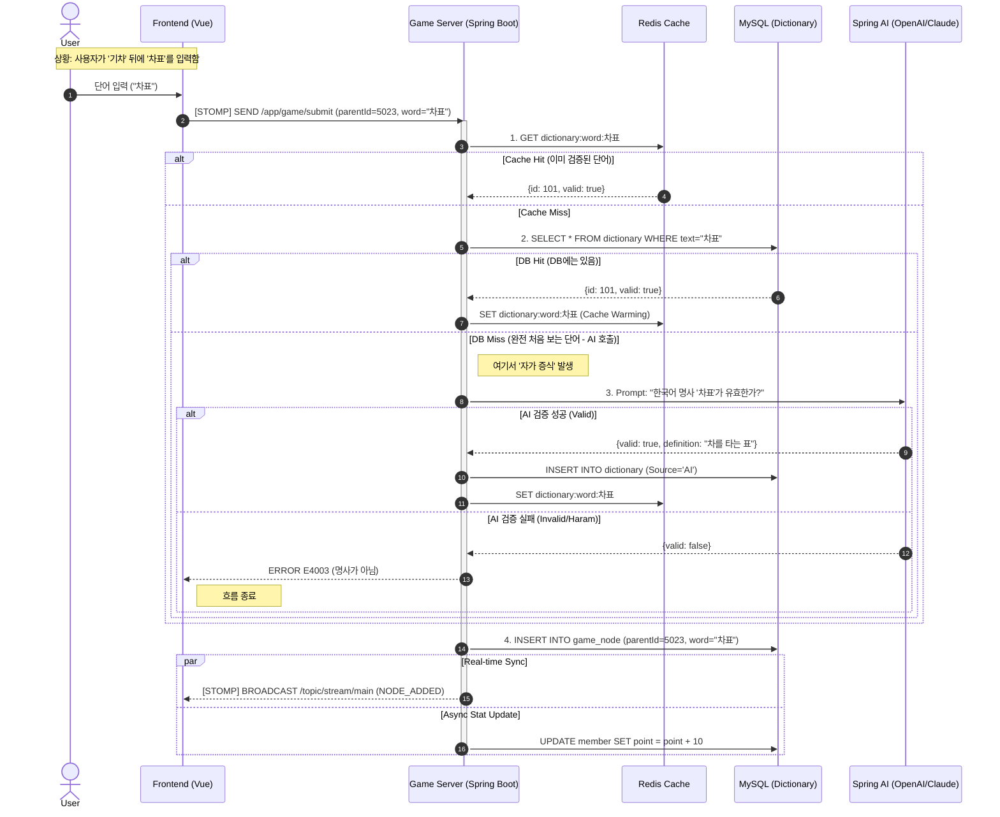

## 1. 단어 검증 및 자가 증식 프로세스 (Word Verification & Self-Growing Pipeline)

이 다이어그램은 사용자가 단어를 입력했을 때, 서버 내부에서 **데이터 조회**(Cache/DB)와 **AI 검증**(LLM)이 어떻게 유기적으로 동작하여 **응답 속도**(Latency)와 **데이터 확장**(Data Growth)을 동시에 잡았는지 보여준다.

---

### 2. 기술적 의사결정 (Technical Decisions)

### 2.1 하이브리드 검증 파이프라인 (Hybrid Validation Pipeline)

- **문제**: LLM(AI) API 호출은 평균 0.5초~1.5초가 소요됨. 실시간 게임에서 매번 호출하면 UX가 망가짐.
- **해결**:
    - **Layer 1 (Redis)**: 자주 쓰이는 단어는 In-Memory에서 0.001초 만에 응답.
    - **Layer 2 (DB)**: 한 번이라도 등장했던 단어는 DB에 영구 저장(Assetization).
    - **Layer 3 (AI)**: 오직 '세상에 처음 등장한 단어'일 때만 호출.
- **효과**: 서비스 운영 기간이 길어질수록 AI 호출 비용은 0에 수렴하고, 응답 속도는 빨라짐.

### 2.2 낙관적 업데이트 vs 비관적 업데이트 (Optimistic vs Pessimistic)

- **전략**: **비관적 업데이트 (Pessimistic Update)** 채택.
- **이유**: 채팅 앱처럼 내 메시지를 먼저 보여주는 게 아니라, '**단어의 유효성**'이 게임의 승패를 좌우하므로 서버의 확실한 검증(ACK) 후에 렌더링하는 것이 데이터 무결성에 유리함.

### 2.3 동시성 제어 (Concurrency Control)

- **시나리오**: 유저 A와 B가 동시에 같은 노드 뒤에 단어를 이으려고 시도.
- **해결**: `game_node` 테이블의 `parent_id`에 Unique Constraint 혹은 Application Level Lock(Redis)을 걸어 선착순 1명만 성공 처리하고, 나머지는 `E4001(이미 이어짐)` 에러 반환.

---