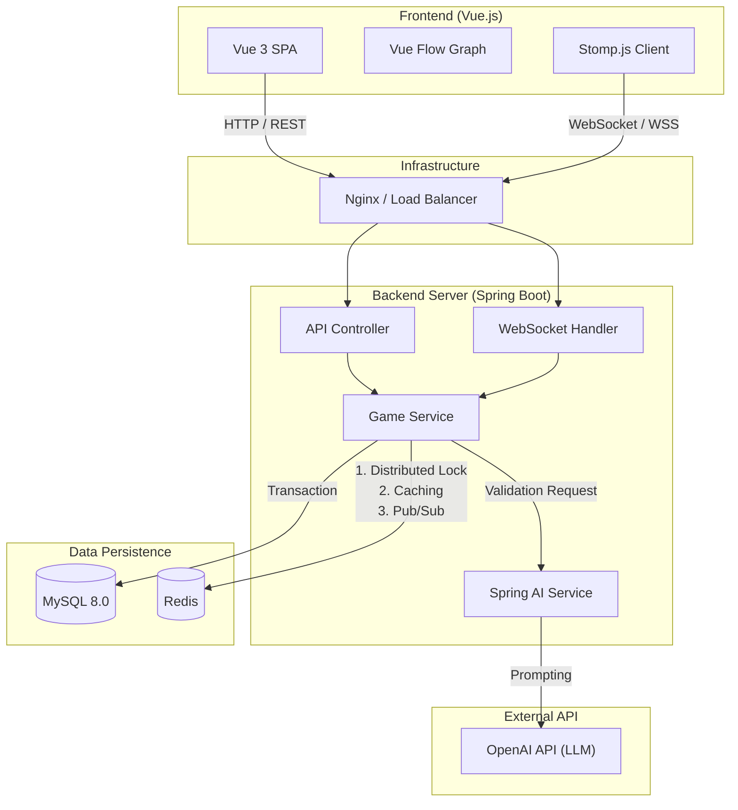

본 프로젝트는 **실시간성**(Real-time)과 **데이터 정합성**(Consistency)을 동시에 확보하기 위해, Event-Driven 방식과 Layered Architecture를 결합한 구조로 설계되었다.

### 1. 아키텍처 다이어그램 (Architecture Diagram)

---

### 2. 컴포넌트별 역할 정의 (Component Roles)

### 2.1 Frontend (Client)

- **Vue.js + Vue Flow**: 복잡한 단어 노드들의 관계를 시각화하고, 사용자 인터랙션(줌, 팬, 클릭)을 처리한다.
- **Stomp.js**: WebSocket 연결을 유지하며, 서버로부터 오는 `BROADCAST` 메시지(메인스트림 변경 등)를 구독(Subscribe)한다.

### 2.2 Backend (Server)

- **Spring Boot 3.2**: 핵심 비즈니스 로직을 수행한다.
- **WebSocket Handler**: 실시간 게임 플레이 데이터를 처리하고, Redis Pub/Sub을 통해 메시지를 전파한다.
- **Spring AI**: 외부 LLM(OpenAI)과의 통신을 추상화하여, 프롬프트 엔지니어링 및 응답 파싱을 담당한다.

### 2.3 Data Storage (Persistence & Cache)

- **MySQL (Main DB)**:
    - `GameStream`, `GameNode`, `Dictionary` 등 영구적인 데이터를 저장한다.
    - 계층형 데이터 조회를 위한 `Recursive CTE` 쿼리를 수행한다.
- **Redis (In-Memory)**: 이 프로젝트의 **핵심 미들웨어**로, 3가지 역할을 수행한다.
    1. **Distributed Lock**: 동시 다발적인 스트림 탈취 및 노드 생성 시 **Race Condition** 방지.
    2. **Caching**: 자주 조회되는 '상위 랭킹 스트림' 및 '자주 쓰이는 단어 사전' 캐싱.
    3. **Pub/Sub Broker**: WebSocket 메시지 브로커 역할을 수행하여 실시간 통신 지원.

### 2.4 External Service

- **OpenAI API**: DB에 존재하지 않는 신조어/사투리 등의 유효성을 검증하는 **Oracle(신탁)** 역할을 수행한다.

---

### 3. 데이터 흐름 (Data Flow)

### 3.1 단어 입력 및 검증 흐름

1. Client → Server: 단어 제출 (Socket)
2. Server → Redis: 캐시 조회 (있으면 즉시 검증)
3. Server → MySQL: DB 조회 (있으면 즉시 검증 & 캐시 갱신)
4. Server → OpenAI: (없을 경우) AI 검증 요청
5. Server → MySQL: 검증 결과 저장 (자가 증식)

### 3.2 실시간 동기화 흐름

1. Server: 게임 상태 변경 감지 (노드 추가/스트림 탈취)
2. Server → Redis: Pub/Sub 채널로 이벤트 발행 (Publish)
3. Server (Sub): 이벤트를 수신하여 접속 중인 모든 소켓 세션에 메시지 전송
4. Client: 메시지 수신 후 그래프 리렌더링 (Re-render)

---